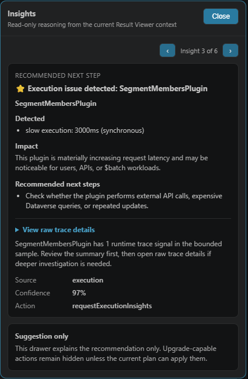
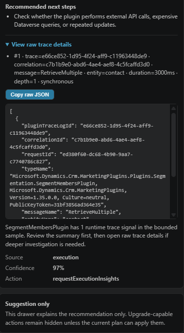

# DV Quick Run

A fast, metadata-aware Dataverse query and workflow workbench for VS Code — with guided traversal, `$batch` execution, preview-first refinement, Smart PATCH, and execution-aware insights with grouped investigation.

**Run, understand, explore, refine, safely update, and diagnose Dataverse execution behaviour — with Query-by-Canvas, Guided Traversal, Smart PATCH, `$batch` workflows, and Execution Insights — without leaving your editor.**

---

## 🚀 What is DV Quick Run?

DV Quick Run turns VS Code into a **Dataverse developer console**.

Instead of switching between Postman, browser tabs, and maker portals, you can:

* Write queries
* Run them instantly
* Explore results in a table
* Investigate records
* Refine queries safely using Query-by-Canvas (preview-first)
* Safely update records with Smart PATCH (preview-first)
* Navigate relationships step-by-step (Guided Traversal)
* Enrich results without rewriting queries
* Inspect execution behaviour using correlation-based Execution Insights

All inside VS Code — with a preview-first, user-controlled workflow.

---

## 🆕 What's New in v0.9.11 (Execution Insights: Batch Investigation + Flow Run Navigation)

> An **execution investigation release** — making Execution Insights easier to act on through grouped `$batch` investigation, batch-aware insight analysis, and Power Automate run navigation when FlowSession evidence is available.

---

### 🔍 Grouped Identifier Investigation (NEW)

When Execution Insights detects grouped identifiers such as:

- `CorrelationId (3)`
- `AsyncOperationId (3)`
- plugin trace identifiers

DV Quick Run now provides:

- **Copy all**
- **Query all**

`Query all` runs a `$batch` request with one sub-request per identifier, then shows each response independently in the Batch Result Viewer.

👉 Results in:
- faster investigation of repeated executions
- cleaner follow-up from insight cards
- no need to manually copy and run each identifier query

---

### 📦 Batch-Aware Execution Insights (NEW)

Execution Insights now work from selected `$batch` sub-results.

Behaviour:
- each batch sub-result keeps its own insight context
- insights run against the selected sub-response, not the batch root
- switching batch sub-results does not leak insight output between responses

👉 Results in:
- clearer debugging of multi-request workflows
- safer per-request diagnosis
- stronger `$batch` investigation loop

---

### 🔗 Power Automate Run Navigation (NEW)

When FlowSession evidence is available, DV Quick Run can surface Power Automate run context.

Provides:
- **Open Flow Run**
- **Copy Run URL**

Behaviour:
- FlowSession evidence is treated as context only
- no flow internals are parsed
- no root-cause claim is made

👉 Enables:
- quicker jump from Dataverse execution context to Power Automate run history
- easier sharing of run links during troubleshooting

> Note: Availability depends on FlowSession data being present in the target environment.

---

### 🛠 Execution Insight Fixes & Refinements

- Fixed source mismatch between async operation evidence and plugin trace insights
- Prevented asyncoperation-shaped rows from producing misleading plugin trace cards
- Improved grouped identifier action labels:
  - `Copy all`
  - `Query all`
- Preserved separate plugin trace and asyncoperation query behaviour

👉 Results in:
- fewer misleading insights
- more trustworthy follow-up actions
- better alignment between insight source and executed query

---

### 🧪 Stability & Behaviour

- Verified across:
  - grouped `$batch` investigation
  - asyncoperation grouped queries
  - plugintracelog grouped queries
  - `$batch` sub-result insights
  - no-noise behaviour when `flowsessions` has no records

- FlowSession support is fixture-validated where live environments do not expose FlowSession records.

- No regression in:
  - Result Viewer
  - Execution Insights
  - `$batch` execution
  - plugin trace insights
  - asyncoperation insights

---

## 🧭 Notes

This release extends Execution Insights from:

- detecting execution signals

→ to:

- investigating grouped execution paths
- analysing batch sub-results independently
- navigating to Power Automate run context when available

Core principles reinforced:
- explicit, user-triggered diagnostics
- source-aware insight actions
- batch results remain separated
- FlowSession is context, not root cause

---

## 🎯 Summary

DV Quick Run now:

- investigates grouped identifiers with `$batch`
- inspects Execution Insights per batch sub-result
- navigates to Power Automate runs when FlowSession evidence exists
- avoids misleading cross-source insight actions

👉 Completes the v0.9.11 execution investigation loop and prepares the platform for:
- insight prioritisation
- timeline reconstruction
- cross-source reasoning

---

## 🎬 Result Viewer


Typical workflow:

start simple → run → explore → refine (Query-by-Canvas) → update safely (Smart PATCH) → refresh → repeat

---

## ⚡ Quick Start

1. Install **DV Quick Run**
2. Login:

   ```
   az login --allow-no-subscriptions
   ```
3. Configure your Dataverse environment
4. Run a query:

   ```
   contacts?$top=10
   ```

---

## ✨ Key Features

### 🔎 Run & Explore Queries

* Run Dataverse queries (OData & FetchXML) directly in VS Code
* View results in an interactive table or JSON
* Sort, filter, inspect, copy, and act on data inline

---

### ✏️ Smart PATCH

* Update Dataverse records directly from the Result Viewer
* Preview PATCH payloads before applying changes
* Use metadata-aware inputs for boolean and choice fields
* Automatically refresh results after successful updates
* Prevent unsafe updates on expanded / related fields

---

### 🔗 Guided Traversal + Enrichment

* Traverse relationships step-by-step across Dataverse tables
* Continue traversal using real data (row-driven)
* Enrich results in-place using **Sibling Expand**
* Build complex multi-entity queries without manual `$expand`

---

### 📊 Execution Insights (Runtime Diagnostics)

Understand what’s happening **behind your Dataverse queries** — without leaving VS Code.

DV Quick Run surfaces **execution behaviour across plugins, async operations, and workflows** directly in the Result Viewer:

- Detect slow, failed, waiting, and repeated execution behaviour  
- Distinguish normal behaviour vs potential issues (same request vs cross-request)  
- See impact and recommended next steps instantly  
- Drill into raw trace and execution data when deeper debugging is needed  

Instead of manually querying `plugintracelogs`, `asyncoperations`, correlating requests, and scanning raw data across multiple tools —

DV Quick Run surfaces the most important execution signals instantly, and lets you drill deeper only when needed.

---

#### 🧠 Insight Summary



- Instantly identifies the relevant execution (plugin, async operation, or workflow)
- Explains why it matters (latency, failures, delays, system impact)
- Tells you exactly what to check next

---

#### 🔬 Raw Trace & Execution Details

Execution Insights bridges the gap between your query and Dataverse execution behaviour using correlation-aware lookup — something that typically requires multiple tools and manual investigation.

👉 Go from high-level insight → exact execution detail → root cause — in one place.



- Correlation-aware inspection (plugin + async + workflow context)  
- Full raw payload available when needed  
- One-click copy for debugging and collaboration  

👉 Jump from summary → execution detail → root cause — without leaving VS Code.

---

### 🧠 Explain Query + Query Doctor

* Break queries into human-readable explanations
* Understand filters, sorting, and structure instantly

**Query Doctor (Intelligent Diagnostics):**

* Analyse your query and detect issues
* Get prioritised diagnostics with confidence scoring
* Receive actionable **Suggested Fixes** with examples

Turn this:
  accounts?$expand=primarycontactid

Into:

* what the query does
* what’s missing
* how to improve it

All directly inside VS Code.

---

### 🔍 Investigate Record

* Select a GUID → investigate instantly
* Works on:
  - primary keys
  - surfaced business GUID fields in results
* See:
  - relationships
  - structured summary
  - **interpretation (what this record likely represents)**
  - suggested queries

---

### ⚡ Smart Query Helpers

* Build queries and updates (GET / PATCH) with guided prompts
* Incrementally refine queries ($select, $filter, $expand, $orderby)
* Generate queries from JSON

---

### 🧬 Metadata Intelligence

* Hover to see field metadata
* Resolve choice labels automatically
* **Refine filter values inline (preview-first)**
* Explore entity relationships

---

### 🌍 Environment Support

* Work across DEV / UAT / PROD
* Safe environment switching
* Environment-aware metadata caching

---

## 🛡 Guardrails

DV Quick Run detects risky query, mutation, and diagnostic scenarios — such as missing `$top`, unsafe PATCH contexts, unsupported expanded-field updates, broad result analysis, or unavailable plugin trace access — and guides you before execution.

---

## 👥 Who Is This For?

* Dataverse / Dynamics 365 developers
* Power Platform engineers
* Integration / API developers

---

## 💡 Why DV Quick Run?

Because the fastest workflow is:

**write → run → explore → refine → update → verify → repeat**

…without leaving your editor.

---

## 🔧 Development

```
npm install
npm run compile
```

Press **F5** to run the extension.

---

## 📜 License

MIT License
