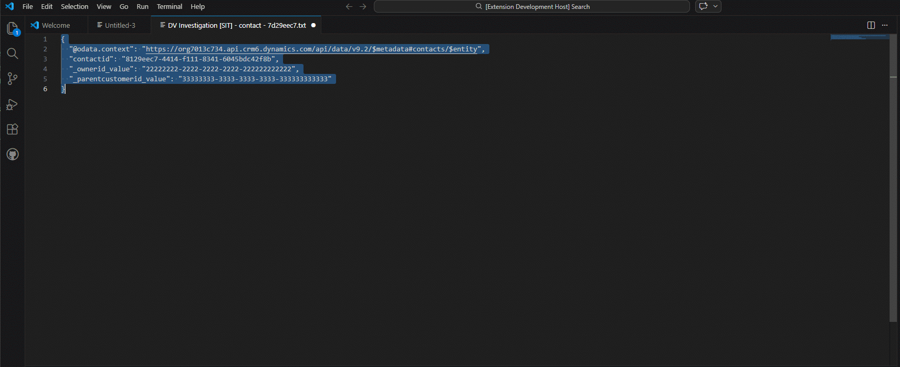

# DV Quick Run
A metadata-aware Dataverse Web API console for VS Code.

**Run, build, understand, and investigate Dataverse Web API data directly inside VS Code with metadata‑aware developer tooling.**

### A Dataverse developer console inside VS Code

DV Quick Run turns VS Code into a **Dataverse developer console**.  
Instead of jumping between Postman, browser tabs, maker portals, and documentation, you can **write, refine, execute, investigate, and explain queries without leaving the editor**.

---

## Keywords

Dataverse • Dynamics 365 • Power Platform • Web API • OData • VS Code extension • Developer tooling

---

## 🆕 What's New in v0.4.2

### 📊 Interactive Result Viewer

DV Quick Run now opens query results in an **interactive Result Viewer** instead of a raw JSON document.

This transforms query execution from a simple API response preview into a **structured Dataverse inspection workspace**.

Features include:

- **TABLE view** for structured query result inspection
- **JSON view** for raw API response analysis
- **RELATIONSHIPS** shortcut for exploring entity relationships
- **Click-to-copy** cells for rapid debugging workflows
- **Row count indicator** and environment context in the viewer header

Example workflow:

run query  
→ inspect results as table  
→ click values to copy  
→ investigate record  
→ jump to Dataverse UI  

All without leaving VS Code.

---

### 🔎 Record Actions Inside Query Results

Primary key fields in the result grid now include **contextual actions**:
    contactid
    7d29eec7-4414-f111-8341-6045bdc42f8b 🔎 ↗

Available actions:

- **🔎 Investigate Record** – run the investigation engine directly from the result grid
- **↗ Open in Dataverse UI** – jump directly to the record in the Dataverse web interface

Actions are automatically enabled for the **entity primary key column**, ensuring the viewer stays clean and avoids noisy UI.

---

### 🔁 Consistent Query Result Experience

All Dataverse GET workflows now use the **Result Viewer**:

- Run Query
- Run Query Under Cursor
- Smart GET
- Smart GET from GUID

This ensures a consistent developer experience when inspecting data returned from Dataverse.

---

### 🧠 Result Viewer Design Philosophy

The Result Viewer introduces the first **visual data inspection layer** inside DV Quick Run.

Instead of treating query results as static JSON, the extension now provides a lightweight **Dataverse debugging workbench** directly inside the editor.

The viewer is designed to support:

- rapid data inspection
- record investigation
- navigation to Dataverse UI
- relationship exploration

without leaving the developer workflow.

This capability lays the groundwork for future features such as:

- query troubleshooting tools
- lookup expansion helpers
- metadata-aware column enrichment
- result filtering and sorting

## 🆕 What's New in v0.4.1

### 🔧 Stabilization & Investigation Reliability

This release focuses on **stabilizing the Investigate Record engine** and improving behavior in real-world Dataverse environments.

Improvements include:

- More reliable entity inference when investigating records from:
  - JSON payloads
  - mixed API responses
  - diagnostic logs
- Improved handling of **custom tables** and complex Dataverse schemas
- Fixed investigation failures caused by incorrect `@odata.context` resolution
- Improved error transparency when Dataverse permissions prevent relationship traversal
- Investigation reports now correctly resolve entity context in documents containing multiple payload blocks

### 🧭 Relationship Analysis Improvements

Relationship exploration artifacts now open with **entity-aware document names**:

- `Relationship Explorer - entity.txt`
- `Relationship Graph - entity.txt`

This makes it easier to work with multiple investigation artifacts inside VS Code.

---

## 🆕 What's New in v0.4.0

### 🔎 Investigate Record

DV Quick Run can now **investigate a Dataverse record directly from a GUID**.

Highlight a GUID in the editor and run:

DV Quick Run: Investigate Record

The extension analyzes the identifier, infers the entity type using metadata and context signals, and produces a structured investigation report.

Example workflow:

highlight GUID  
→ right click  
→ Investigate Record  
→ get investigation summary  
→ explore relationships  
→ run suggested follow‑up queries  

Investigation reports include:

- **SUMMARY** – key identity, lifecycle, ownership, and business fields  
- **POINTS TO** – direct lookup relationships from the record  
- **REVERSE LINKS** – entities that may reference this record  
- **SUGGESTED QUERIES** – follow‑up queries to continue investigation  

Example investigation:

Example investigation output:

[Example investigation output](docs/investigation-contact-example.txt)

This feature turns DV Quick Run into a **Dataverse investigation tool**, allowing engineers, testers, and support teams to understand a record quickly without navigating the Dataverse UI.

Investigate Record is designed for situations where a GUID appears in logs, payloads, or integration traces and the engineer needs to quickly understand what that record represents and how it relates to other entities.

---

## 🚀 Animated Demo

Typical workflow:

write query  
→ refine query  
→ run query  
→ inspect results  
→ explain query  
→ improve query  

Everything happens **inside VS Code**.

---

# ⚡ Quick Start

1. Install **DV Quick Run**
2. Login with Azure CLI
    az login --allow-no-subscriptions

3. The first time you run DV Quick Run you will be prompted to **configure a Dataverse environment**.

Provide:

- **Environment name** (example: DEV)
- **Dataverse URL** (example: https://org.crm6.dynamics.com)
- **Optional status color** (white / amber / red)

4. Write a Dataverse query in a file
contacts?$top=10

5. Click **Run Query** in CodeLens.

# 🌍 Environment Profiles

DV Quick Run supports working with **multiple Dataverse environments**.

Typical setups include:

- DEV
- SIT
- UAT
- PROD

The currently active environment is shown in the **VS Code status bar**.

Example:
DV: DEV

## Environment Commands

Available commands:

- **DV Quick Run: Add Environment**
- **DV Quick Run: Select Environment**
- **DV Quick Run: Remove Environment**

These commands manage the environments stored in:
dvQuickRun.environments

inside your VS Code settings.

## Environment Safety

To prevent cross-environment issues:

- Metadata caches are **scoped per environment**
- Session caches are **cleared automatically when switching environments**
- Diagnostics clearly show **which environment's cache is being inspected**
---

# ✨ Why DV Quick Run?

Working with the Dataverse Web API usually involves a fragmented workflow:

- Write a query
- Copy it into Postman
- Run it
- Inspect results
- Look up metadata
- Adjust the query
- Repeat

DV Quick Run collapses that loop into a **single editor experience**.

---

# 🔎 CodeLens Query Execution

DV Quick Run automatically detects probable Dataverse queries and adds **inline CodeLens actions**.

[Run Query] [Explain]
accounts?$top=10

This turns your editor into a **lightweight Dataverse query workbench**.

---

# 🧠 Explain Query

Understanding a Dataverse query can sometimes be harder than writing it.

DV Quick Run breaks a query into **human-readable sections**.

Example query:
contacts?$select=fullname&$filter=contains(fullname,'john')&$orderby=createdon desc&$top=25

Explain Query shows:

- entity path
- record vs collection query
- selected fields
- filter meaning
- sort order
- query shape advice

Great for **learning and reviewing queries**.

---

# 🔍 Metadata Hover

Hover over fields inside a query to see **Dataverse metadata**.

Example:
contacts?$select=fullname,emailaddress1

Hovering a field may display:

- logical name
- display name
- attribute type
- choice values (if applicable)

Metadata is cached for fast repeated lookups.

---

# 🔧 Smart GET from GUID

Select a GUID in the editor and instantly generate a record query.

Example selected GUID:

    7d29eec7-4414-f111-8341-6045bdc42f8b

Generated query:

    contacts(7d29eec7-4414-f111-8341-6045bdc42f8b)

Or pick fields:

    contacts(7d29eec7-4414-f111-8341-6045bdc42f8b)?$select=fullname,emailaddress1

---

# 🧰 Query Mutation Helpers

Incrementally refine existing queries.

Available helpers:

- **Add Fields ($select)**
- **Add Filter ($filter)**
- **Add Expand ($expand)**
- **Add Order ($orderby)**

Example transformation:

Original:

    contacts

Add fields:

    contacts?$select=fullname,emailaddress1

Add filter:

    contacts?$select=fullname,emailaddress1&$filter=contains(fullname,'john')

---

# ⚙️ Smart GET Builder

Generate Dataverse queries through guided prompts.

Workflow:

Choose entity  
→ Choose fields  
→ Optional filters  
→ Optional sorting  
→ Build query  
→ Run query  

Example generated query:
accounts?$select=name,accountnumber

---

# ✏️ Smart PATCH Builder

Update Dataverse records using guided prompts.

Workflow:

choose entity  
→ choose record  
→ choose fields  
→ enter values  
→ execute PATCH  

No manual request construction required.

---

# 🔁 Generate Query from JSON

Convert a JSON record into a Dataverse query skeleton.

Example JSON:

    {
      "fullname": "John Smith"
    }

Generated query:

    contacts?$filter=fullname eq 'John Smith'

Useful when exploring Dataverse responses.

---

# 🔗 Relationship Explorer

Explore how Dataverse entities are connected.

Example:

    contact
    ├─ createdby → systemuser
    ├─ parentcustomerid_account → account
    └─ parentcustomerid_contact → contact

This helps developers understand **which `$expand` paths are available**.

The generated report opens as:

`Relationship Explorer - entity.txt`

making it easy to inspect relationships while investigating records.

### Relationship Graph View

Graph view shows the **relationship structure of an entity** in a readable hierarchy.

Example output:

`Relationship Graph - entity.txt`

This provides a quick structural overview of how an entity connects to other tables.

Graph view currently shows **direct (1-level) relationships**.

Future versions will support **recursive traversal**.

---

# 🛡 Guardrails for Risky Queries

DV Quick Run detects risky query shapes such as:

- missing `$top`
- overly broad queries
- expensive query patterns

Instead of silently executing them, the extension warns and asks for confirmation before sending the request.

---

# 🧠 Metadata Intelligence

DV Quick Run uses Dataverse metadata to power many of its features.

This enables:

- intelligent field pickers
- navigation property discovery
- query explanation
- schema-aware helpers
- relationship exploration

This metadata intelligence layer is the foundation for future features such as:

- query validation
- relationship traversal
- query intent suggestions

---

# 🔬 Metadata Diagnostics

DV Quick Run includes commands to inspect and manage metadata caches.

Available commands:

- Show Metadata Diagnostics
- Clear Metadata Session Cache
- Clear Persisted Metadata Cache

These tools help developers verify metadata loading behaviour and recover quickly after schema changes.

Diagnostics are **scoped to the currently active environment**, ensuring caches from different environments do not mix.

---

# 🔐 Authentication

DV Quick Run uses **Azure CLI authentication**.

If you are already logged in with Azure CLI, the extension will reuse that token.

Login example:

    az login --allow-no-subscriptions

No client secrets or OAuth configuration required.

Tokens are cached per Dataverse environment scope, allowing DV Quick Run to safely switch between environments without re-authenticating unnecessarily.

---

# 👥 Who Is This For?

DV Quick Run is designed for:

- Dataverse developers
- Dynamics 365 engineers
- Power Platform technical teams
- API developers integrating with Dataverse
- Integration engineers

---

# 🛠 Development

Run locally:
npm install
npm run compile

Press **F5** in VS Code to launch the **Extension Development Host**.

---

# 📜 License

MIT License

---

# 💡 Final Thought

DV Quick Run is built around one idea:

**The fastest Dataverse workflow is the one that never leaves the editor.**