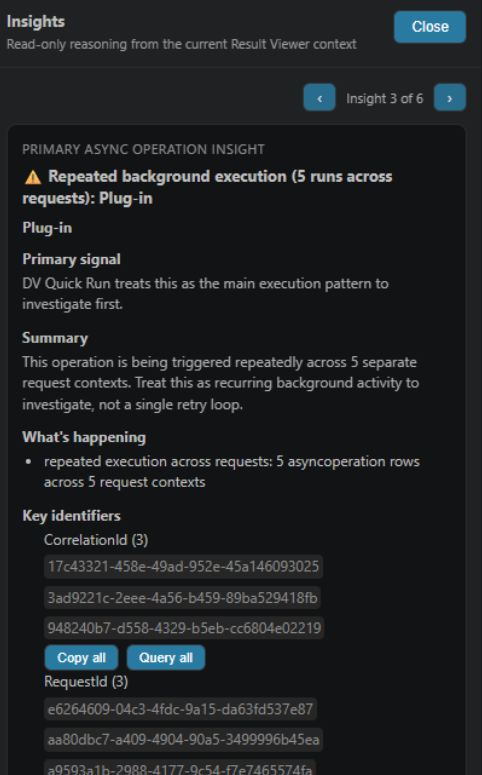
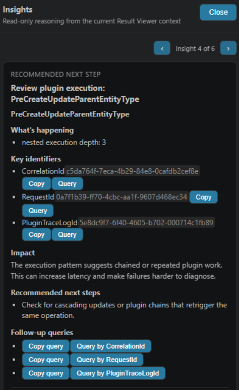
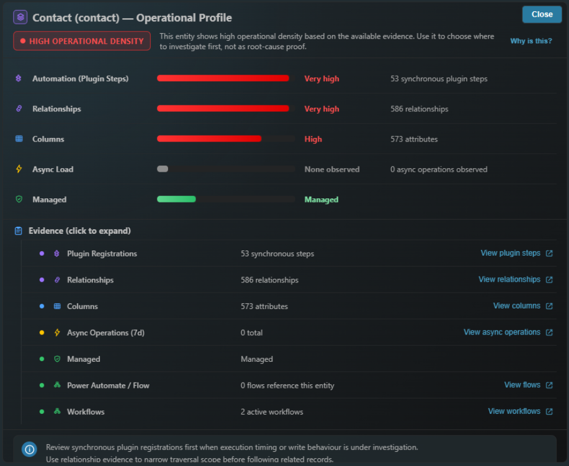
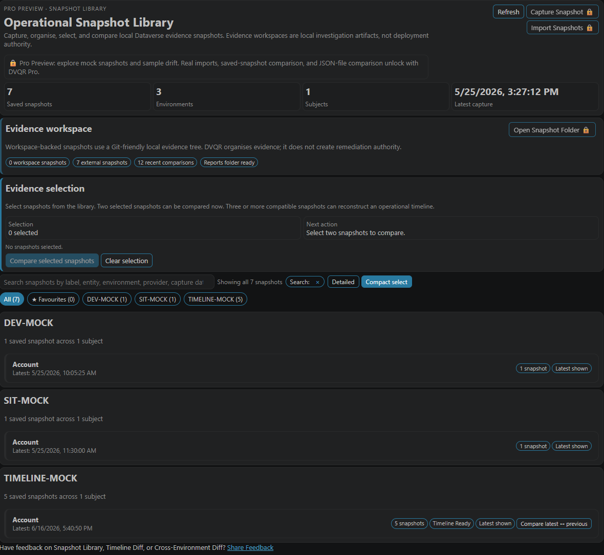
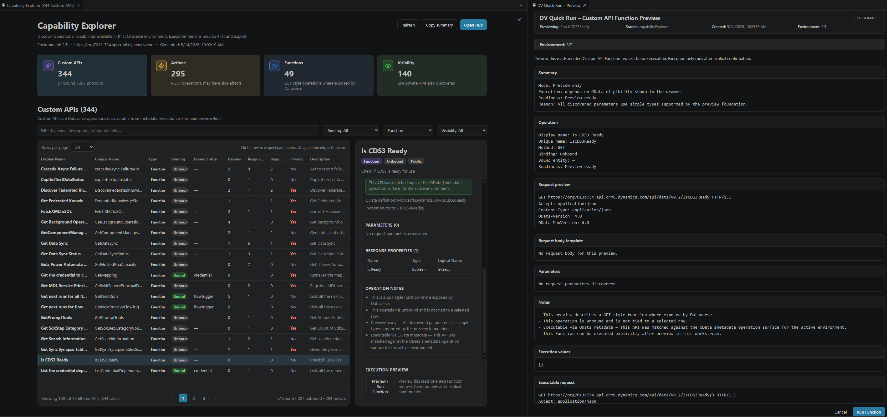
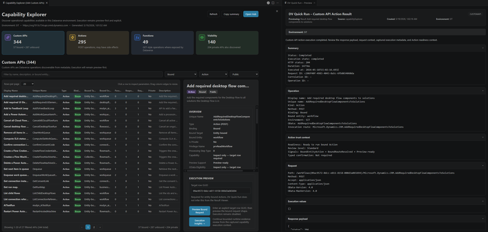
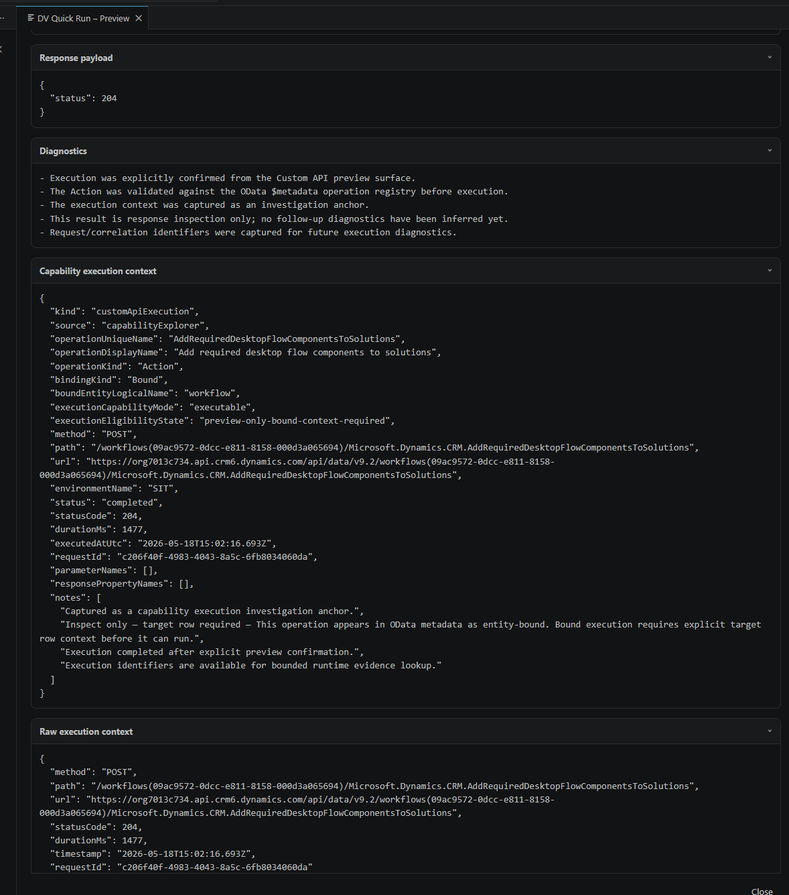

# DV Quick Run

A fast, metadata-aware Dataverse query, evidence, and operational investigation workbench for VS Code.

**Run, understand, explore, refine, safely update, execute governed operational capabilities, compare operational snapshots, reconstruct operational timelines, verify drift evidence, export DVBUR artifacts, export DVAF reconstruction artifacts, and investigate Dataverse behaviour — with Query-by-Canvas, Guided Traversal, `$batch`, Smart PATCH, Capability Explorer, Execution Insights, Operational Profiles, Operational Context, Access Context, Evidence Workspace, Snapshot Library, Timeline Reconstruction, Timeline Graph, Timeline Findings Summary, Timeline Investigation Handoff, Cross-Environment Diff, Audit Evidence Enrichment, Reconstruction Artifacts, DVAF reconstruction export, inline evidence continuation, Pro activation, and the DV Quick Run Hub — without leaving your editor.**

---

## 🌐 Website & Interactive Demo

Official website:

```text
https://www.dvquickrun.com
```

The website includes:

* product overview
* roadmap direction
* operational investigation philosophy
* feature walkthroughs
* marketplace/install links
* Free / Pro / Offline pricing and activation guidance
* interactive mock HTML comparison reports demonstrating DV Quick Run investigation workflows
* sample Diff Findings Summary, Timeline Findings Summary, Investigation Handoff, Timeline Investigation Handoff, audit-aware report flows, and Reconstruction Artifact handoff flows

The interactive HTML demo helps illustrate:

* grouped operational drift investigation
* inline evidence continuation
* operational verification workflows
* Findings / Verification / Handoff investigation flow
* Timeline Reconstruction, interval graph, first-observed drift, audit evidence enrichment, and reconstruction artifact report flows
* dense enterprise comparison readability
* operational investigation continuity
* report export mental models for Diff Findings Summary, Timeline Findings Summary, Investigation Handoff, and Timeline Investigation Handoff workflows

without requiring a live Dataverse environment.

---

## 🚀 What is DV Quick Run?

DV Quick Run turns VS Code into a focused **Dataverse developer and investigation console**.

Instead of switching between Postman, browser tabs, maker portals, Excel, and manual metadata lookups, you can:

* run OData and FetchXML queries
* inspect results in a table or JSON view
* refine queries safely using preview-first workflows
* update records using Smart PATCH
* traverse Dataverse relationships step-by-step
* run related queries as `$batch`
* investigate runtime behaviour with Execution Insights
* understand entity operational footprint with Operational Profiles
* inspect bounded Operational Context for solution layering, access, runtime actor, and ownership signals
* investigate bounded Access Context for users, application users, teams, roles, and business units
* compare operational snapshots through Snapshot Library, Timeline Reconstruction, and Cross-Environment Diff
* continue investigation from comparison evidence using bounded inline pivots
* reconstruct first-observed operational drift across 3+ same-environment snapshots
* enrich Timeline Reconstruction and Cross-Environment Diff findings with snapshot-bounded Dataverse audit evidence
* export DVAF reconstruction artifacts from eligible source-side Column Metadata Drift findings
* preserve Reconstruction Artifact references in Timeline and Cross-Environment reports
* review, verify, comment on, and hand off operational drift findings
* export Diff Findings Summary, Timeline Findings Summary, Investigation Handoff, and Timeline Investigation Handoff reports as HTML/PDF artifacts
* export DVBUR artifacts from Result Viewer records for downstream DV Bulk Upsert Runner workflows
* discover and execute supported Custom API capabilities through Capability Explorer
* activate Online Pro, import Offline Pro licenses, and inspect capability status
* use the Hub to stay oriented across investigation workflows
* capture and organise operational snapshots in a local Evidence Workspace

DV Quick Run is designed around a simple loop:

```text
write → run → explore → refine → investigate → reconstruct evidence → verify → hand off
```

---

## ⚡ Quick Start

1. Install **DV Quick Run**
2. Login:

   ```bash
   az login --allow-no-subscriptions
   ```

3. Configure your Dataverse environment
4. Run a query:

   ```http
   contacts?$top=10
   ```

5. Open the Hub any time:

   ```text
   DV Quick Run: Open Hub
   ```

---

## 🔐 DV Quick Run Pro Activation

DV Quick Run is available in Free and Pro editions.

Free preserves foundational operational understanding workflows. Pro accelerates advanced operational investigation workflows such as real snapshot comparison, replay continuity, report exports, and investigation handoff workflows.

Learn more:

```text
https://www.dvquickrun.com/pricing
```

Direct purchase / checkout:

```text
https://dvforgelab.lemonsqueezy.com
```

To activate Online Pro:

1. Purchase a DV Quick Run Pro subscription.
2. Open Visual Studio Code.
3. Run:

   ```text
   DV Quick Run: Activate Pro License
   ```

4. Paste the license key from your Lemon Squeezy purchase.

To inspect your current entitlement:

```text
DV Quick Run: License Status
```

Online recurring subscriptions display as:

```text
Subscription: Active
```

Eligible Pathfinder licenses show:

```text
DVQR Pathfinder • Early Supporter
```

Offline Pro customers can import a signed offline license using:

```text
DV Quick Run: Import Offline License
```

Offline Pro is designed for restricted, disconnected, and air-gapped environments where recurring online validation is not suitable.

---

## 🆕 What's New in v0.13.3

v0.13.3 introduces the first **Identity Participation Reconstruction** workflow within the DV ForgeLab ecosystem.

DV Quick Run can now identify eligible source-side Identity Participation Drift, generate bounded reconstruction intent artifacts, and hand those artifacts directly to DV Identity Manager for preview-first staging and explicit application.

Highlights include:

* DVIM reconstruction artifact export
* source-side identity participation reconstruction candidates
* Cross-Environment Diff DVIM export support
* Timeline Reconstruction DVIM export support
* Reconstruction Artifacts report sections
* shared DV ForgeLab workspace expansion
* workspace-first report exports
* reusable reconstruction artifact experience

DV Quick Run continues to reinforce:

```text
DVQR investigates observed evidence.

DVIM reconstructs identity participation.

Investigation and reconstruction remain separate concerns.
```

### Identity Participation Reconstruction

Eligible Identity Participation Drift findings can now generate reconstruction intent artifacts.

DV Quick Run can:

* identify source-side identity participation drift
* classify reconstruction candidates
* generate DVIM-compatible reconstruction definitions
* preserve source-side participation alongside investigation evidence
* maintain investigation boundaries

Behaviour:

* exports are explicit and user-triggered
* only source-side participation is exported
* target-side additions remain observational
* artifacts are advisory-only handoffs

### DVIM Export Integration

Cross-Environment Diff and Timeline Reconstruction now support:

```text

### Reconstruction Artifacts

Eligible Column Metadata Drift findings can now generate reconstruction intent artifacts.

DV Quick Run can:

* identify source-side attribute drift
* classify reconstruction candidates
* generate DVAF-compatible reconstruction definitions
* preserve source-side metadata alongside investigation evidence
* maintain investigation boundaries

Behaviour:

* exports are explicit and user-triggered
* only source-side definitions are exported
* target-side additions remain observational
* shadow/system companion attributes are blocked from export
* artifacts are advisory-only handoffs

### DVAF Export Integration

Cross-Environment Diff and Timeline Reconstruction now support:

```text
Export DVAF Artifact
```

for eligible source-side Column Metadata Drift findings.

Generated artifacts preserve supported source-side metadata and can be reviewed externally in DV Attribute Factory before any reconstruction activity occurs.

Supported DVAF reconstruction handoff currently covers:

* Text / Multiline Text
* Whole Number / Decimal / Currency
* Date Only / Date and Time
* Yes/No
* Choice / Picklist values
* Lookup target metadata

Boundary notes:

* DVQR exports reconstruction intent only
* DVAF validates, previews, and creates supported metadata
* Global choice lifecycle management belongs to DV Choice Editor
* DVQR does not decide the source is correct, the target is wrong, or changes should be applied

### Reconstruction Artifacts in Reports

Timeline and Cross-Environment reports now include Reconstruction Artifact references when exports were generated during the investigation workflow.

Reports can preserve:

* artifact filename
* entity context
* attribute context
* reconstruction rationale
* support status
* export references

### Workspace Expansion

DV ForgeLab workspace organisation now separates investigation evidence from reconstruction intent.

Example:

```text
.dvforgelab
├─ dvaf
│  └─ exports
└─ dvqr
   ├─ comparisons
   ├─ reports
   └─ snapshots
```

This keeps DVQR investigation artifacts and DVAF reconstruction artifacts independent while supporting ecosystem continuity.

### Hub, Welcome & Quickstart Updates

Updated product messaging across:

* Welcome experience
* DV Quick Run Hub
* Evidence Workspace guidance
* Snapshot Library guidance
* Cross-Environment Diff and Timeline Reconstruction playbooks
* Quickstart investigation continuity guidance

The Hub now includes dedicated playbooks for:

* investigating environment differences
* reconstructing change over time
* generating reconstruction artifacts where supported

## 🎬 Result Viewer


The Result Viewer is the main interactive surface for exploring query results.

Typical workflow:

```text
start simple → run → explore → refine → update safely → refresh → repeat
```

Result Viewer also acts as an operational launch surface. From a primary row id, you can open **Bound Actions on this record** to preview compatible entity-bound Actions for that specific row.

The Result Viewer only supplies target row context. Execution still flows through DV Quick Run’s governed preview surface:

```text
row → bound Action preview → explicit confirmation → execution result → investigation context
```

---

### 📦 Result Viewer → DVBUR Artifact Export

DV Quick Run can export Result Viewer records as DVBUR-compatible artifacts for DV ForgeLab's **DV Bulk Upsert Runner**.

This supports a focused ecosystem workflow:

```text
DVQR investigates
→ exports a DVBUR artifact
→ DVBUR performs focused bulk upsert execution
```

The export remains explicit and user-triggered.

DV Quick Run does not perform automatic remediation or hidden bulk updates. It prepares an artifact from observed Result Viewer data so the execution workflow can remain separated in DV Bulk Upsert Runner.

---

## ✨ Key Features

### 🔎 Run & Explore Queries

* Run Dataverse OData and FetchXML directly in VS Code
* View results in an interactive table or JSON
* Sort, filter, inspect, copy, and act on data inline
* Use Ctrl+Enter to run the query under your cursor

---

### 🧭 DV Quick Run Hub

The Hub provides a calm orientation surface for operational investigation workflows.

It helps you:

* understand current investigation context
* see whether a Result Viewer context is active, recoverable, historical, or stale
* reopen recoverable Result Viewer sessions
* track selected `$batch` sub-results
* pivot to related investigation surfaces
* discover Snapshot Library and operational comparison workflows
* open DVQR GitHub Discussions for feedback, bugs, workflow ideas, and roadmap conversation
* avoid stale context after environment switches

The Hub is optional. It does not take over the workflow; it helps you recover orientation when you need it.


---

### 🔐 Access Context

Access Context helps you investigate bounded operational identity participation without leaving VS Code.

You can investigate:

* users
* application/service identities
* teams
* roles
* business units

Access Context can surface:

* business-unit context
* direct role participation
* team participation
* inherited participation
* member composition
* role participation
* notable operational participants
* raw verification evidence

It is designed for operational investigation, not security administration.

Access Context does not:

* simulate RBAC
* calculate effective record access
* generate privilege matrices
* infer security risk
* perform recursive environment-wide topology crawling

Access Context can be launched from:

* Command Palette
* DV Quick Run Hub
* Result Viewer row actions

Common Result Viewer continuations include:

```text
systemusers.systemuserid       → Check User Access Context
systemusers.systemuserid       → Check Application User Context
teams.teamid                   → Check Team Access Context
roles.roleid                   → Check Role Access Context
businessunits.businessunitid   → Check Business Unit Context
```

Access Context remains summary-first, searchable, exportable, and bounded to the current investigation subject.

---

### 🧩 Query-by-Canvas

Query-by-Canvas is DV Quick Run’s preview-first refinement model.

Start simple, then refine from results:

```text
contacts
→ add $top
→ add $select
→ filter by value
→ rerun
```

Supported refinement paths include:

* add fields
* filter by value
* preview query changes
* apply safely
* rerun and verify

---

### 🔗 Guided Traversal

Guided Traversal helps you navigate relationships across Dataverse tables.

Use it to:

* find paths between entities
* traverse using real returned rows
* continue exploration step-by-step
* understand relationship routes visually
* replay traversal flows as `$batch`

---

### 🕸️ Relationship Graph

DV Quick Run includes a dedicated Relationship Graph workspace for exploring Dataverse entity relationships.

Relationship Graph can surface:

* relationship counts by type
* Many-to-One relationships
* One-to-Many relationships
* Many-to-Many relationships
* navigation properties
* target entities
* relationship schema names

The workspace supports:

* live search
* match highlighting
* next/previous navigation
* automatic match focus
* exact text export
* exact text copy

Relationship Graph is designed for operational metadata understanding.

It does not perform recursive graph analysis, dependency impact analysis, or deployment validation.

Relationship Graph can be launched directly from:

```text
Result Viewer
→ View Relationships
```

The original relationship artifact remains available through:

```text
Save Exact Text
Copy Exact Text
```

so visual exploration and exported evidence remain consistent.

---

### 📦 `$batch` Workflows

Run multiple related queries together using `$batch`.

Useful for:

* validating several endpoints together
* investigating related tables in one execution
* replaying Guided Traversal routes
* comparing related results without manual switching

The Hub tracks selected `$batch` sub-results so investigation context stays aligned with the selected response.

---

### ✏️ Smart PATCH

Smart PATCH lets you update Dataverse records directly from the Result Viewer using a preview-first workflow.

It supports:

* previewing PATCH payloads before execution
* metadata-aware boolean and choice inputs
* automatic result refresh after update
* guardrails for expanded or unsafe update contexts

---

### 📊 Execution Insights

Understand what is happening **behind your Dataverse queries** without leaving VS Code.

DV Quick Run surfaces execution behaviour across plugins, async operations, workflows, and Power Automate-related context.

It can help identify:

* slow execution
* failed or waiting async operations
* repeated execution patterns
* nested plugin behaviour
* correlation/request-linked runtime evidence



Execution Insights prioritises the strongest signal first, then keeps supporting evidence available for deeper investigation.



---

### 🧭 Operational Profiles

Operational Profiles help you understand the **operational footprint** of a Dataverse entity before diving into deeper troubleshooting.

Profiles can surface:

* plugin orchestration density
* relationship complexity
* metadata footprint
* async participation
* Power Automate involvement
* workflow participation
* managed-state context
* comparison-ready snapshot evidence for operational comparison and Timeline Reconstruction workflows



Operational Profiles are:

* entity-scoped
* user-triggered
* evidence-backed
* bounded
* advisory-only

They help identify good investigation starting points without implying speculative root cause.

Operational Profile snapshot export is capability-aware: Free keeps operational understanding available, while Pro unlocks snapshot persistence, comparison workflows, and Timeline Reconstruction workflows.

---

### 🔄 Evidence Workspace, Snapshot Library, Timeline Reconstruction & Cross-Environment Diff

DV Quick Run includes a local DV ForgeLab Evidence Workspace for organising investigation artifacts and reconstruction handoffs:

```text
.dvforgelab
├─ dvaf
│  └─ exports
└─ dvqr
   ├─ comparisons
   ├─ reports
   └─ snapshots
```

Snapshot Library coordinates saved operational investigation snapshots and acts as the central console for comparison and timeline reconstruction.

It supports:

* source and target snapshot selection
* 3+ snapshot timeline reconstruction selection
* grouping snapshots by environment and subject
* latest-vs-previous snapshot comparison
* snapshot search and filtering
* grouped recent comparison history
* replayable recent comparisons
* bounded comparison-history rendering
* comparison-history cleanup without deleting snapshots
* mock snapshot exploration in Free / Pro Preview mode
* built-in `TIMELINE-MOCK` snapshots for timeline preview
* real snapshot workflows in Pro

DV Quick Run uses the selected evidence shape to guide the workflow:

```text
2 compatible snapshots
→ Operational Comparison

3+ compatible snapshots from the same environment and entity
→ Operational Timeline Reconstruction

different environments
→ Cross-Environment Diff
```

Timeline Reconstruction is intentionally restricted to same-environment, same-entity snapshots.

Cross-environment timelines are blocked because they would mix environment comparison with historical evidence reconstruction.

### ⏱️ Operational Timeline Reconstruction

Operational Timeline Reconstruction helps investigators understand how operational evidence evolved across multiple snapshots.

Select:

```text
3+ snapshots
same environment
same entity / subject
```

DV Quick Run reconstructs:

* snapshot-bounded intervals
* first-observed drift windows
* Timeline Graph
* provider distributions
* significance distributions
* Timeline Trust
* Timeline Findings Summary reports
* Timeline Investigation Handoff reports
* optional Audit Evidence Enrichment where Dataverse audit rows are available

Timeline Reconstruction can show provider-backed operational drift across:

* Operational Profiles
* Plugin Step Runtime Behaviour
* Solution Participation
* Workflow / Automation Participation
* Identity Participation
* Relationship Metadata Drift
* Column Metadata Drift
* Choice Metadata Drift
* Entity Configuration Drift

Timeline findings answer:

```text
What changed?
When was it first observed between snapshot captures?
Which evidence provider detected it?
What supporting evidence exists?
```

Timeline findings do not claim:

```text
exact change time
root cause
human responsibility
remediation status
operational authority
```

### 📈 Timeline Graph

Timeline Graph provides a visual reconstruction of selected snapshot intervals.

It shows:

* ordered snapshot progression
* interval boundaries
* event density by interval
* first-observed drift concentration
* clickable interval navigation in the timeline investigation surface

This makes timeline investigations easier to scan before reviewing detailed findings.

### 📄 Timeline Reports

Timeline Reconstruction can export dedicated timeline artifacts:

* **Timeline Findings Summary** — executive-style timeline summary focused on first-observed drift, interval distribution, provider contribution, significance mix, timeline trust, and top findings
* **Timeline Investigation Handoff** — evidence-first handoff report for investigation continuity, sharing, escalation, and operational review

Timeline reports are available as branded HTML/PDF artifacts.

They preserve:

* timeline range
* snapshot count
* interval count
* event count
* snapshot-bounded interval timeline
* provider distribution
* significance distribution
* top timeline events
* evidence references
* audit evidence where explicitly queried before export
* trust and verification boundaries


### 🔍 Audit Evidence Enrichment

Audit Evidence Enrichment adds optional Dataverse audit context to Timeline Reconstruction and Cross-Environment Diff investigations.

When audit evidence is queried, DV Quick Run searches within the relevant snapshot-bounded investigation window and renders matching audit rows alongside the related finding.

Audit evidence may include:

* recorded timestamp
* recorded user / actor where available
* operation and action labels
* changed attributes for supported entity update payloads
* security or relationship association information
* partially interpreted Dataverse audit payloads
* raw payload preservation in HTML reports

Audit Evidence Enrichment is intentionally bounded:

```text
Audit evidence enriches investigation context.
Audit evidence does not establish causality, deployment correctness, remediation status, or operational authority.
```

Dataverse audit payload interpretation is experimental. Some payloads may be partially interpreted or preserved as raw evidence so users can submit edge cases through Feedback.

### 🧩 Reconstruction Artifacts

Reconstruction Artifacts preserve supported source-side metadata drift as explicit DVAF handoff files.

Eligible Column Metadata Drift findings can export `.dvaf.json` artifacts into:

```text
.dvforgelab/dvaf/exports
```

These artifacts can be imported into DV Attribute Factory for preview-first reconstruction of supported metadata.

DVQR may export reconstruction intent for supported source-side definitions such as:

* text and multiline text
* numeric and currency columns
* date columns
* choice columns with captured option values
* lookup columns with captured target metadata

DVQR blocks export for non-standalone companion attributes, shadow columns, and source metadata that is not valid for create.

Reconstruction Artifacts are handoffs only:

```text
DVQR investigates and exports reconstruction intent.
DVAF validates, previews, and creates supported metadata.
Humans retain operational authority.
```

Global choice lifecycle reconstruction is intentionally left for DV Choice Editor rather than DV Attribute Factory.




The Snapshot Library provides Evidence Workspace management, snapshot selection, timeline reconstruction, cross-environment comparison, and built-in TIMELINE-MOCK samples for free timeline previews.

### 🎭 Free Timeline Preview

DV Quick Run includes built-in `TIMELINE-MOCK` snapshots.

Free users can:

* explore timeline workflows
* select mock timeline snapshots
* generate sample Timeline Graphs
* export sample Timeline Findings Summary reports
* export sample Timeline Investigation Handoff reports
* understand first-observed drift analysis without setup

Real operational timeline reconstruction remains Pro capability-aware.

### Cross-Environment Diff

Cross-Environment Diff remains the workflow for comparing snapshots across different environments.

Comparison reports preserve scope awareness so exported artifacts clearly identify the operational subject being compared, for example:

```text
Cross-Environment Diff: Contact • DEV → SIT
```

When snapshots represent different operational subjects, DV Quick Run warns before continuing so users do not accidentally treat unrelated subjects as meaningful operational drift.

Dense comparison reports use grouped operational surfaces so investigations remain readable at enterprise scale. High-signal drift remains visible first, while lower-priority evidence is grouped with:

* classification rationale
* evidence summaries
* representative drift signals
* operational-priority explanation
* full JSON/HTML evidence continuity

Comparison reports also support interactive operational verification workflows. Evidence rows can open inline investigation context directly from the report, including bounded live pivots where DV Quick Run can safely query the active Dataverse environment.

Inline evidence continuation supports:

* solution participation evidence
* identity/team/role participation evidence
* workflow and automation participation evidence
* grouped representative signals
* custom/publisher-prefixed entity metadata context
* captured context-only evidence with explanatory fallback wording

The comparison workspace is organised around:

* **Findings** — review the operational drift evidence
* **Verification** — track what has been reviewed, externally checked, or still needs follow-up
* **Handoff** — preserve operational notes and review posture for human investigation continuity

Review and verification state is local to the comparison workflow and remains investigation-oriented. Marking something reviewed does not imply remediation, correctness, access authority, or root-cause certainty.

Comparison reports can be exported as dedicated operational artifacts:

* **Diff Findings Summary** — concise operational briefing focused on strongest drift signals, executive summary, significance distribution, provider distribution, snapshot trust, and top operational findings
* **Investigation Handoff** — verification-oriented handoff package focused on outstanding operational review, grouped evidence continuity, review posture, and external follow-up context
* **HTML reports** — readable, branded report exports that preserve operational hierarchy and evidence-backed summaries
* **PDF reports** — branded, watermarked, print-friendly exports for review packs, CAB discussions, handoff, escalation, and stakeholder communication

The comparison toolbar groups report exports under:

```text
Reports
```

so standard evidence exports and report artifacts stay distinct:

```text
Save JSON / Save MD / Save HTML / Reports / Reset Review State
```

The comparison and timeline models are intentionally observational:

```text
DVQR observes operational drift.
DVQR does not fix operational drift.

DVQR reconstructs observed evidence.
DVQR does not reconstruct historical certainty.
```

Operational comparison and timeline reconstruction are not deployment tooling, remediation automation, root-cause certainty, or environment authority.

They are designed to help you understand:

* what changed
* when drift was first observed
* where operational density shifted
* which providers contributed evidence
* which drift signals may deserve follow-up investigation
* whether runtime plugin or automation participation differs between snapshots
* whether platform-layer drift is low-priority context or relevant to the investigation
* whether a comparison or timeline is scope-aligned before treating drift as meaningful

Audit Evidence Enrichment is available in v0.13.1.

Current coverage includes:

* snapshot-bounded audit retrieval
* Timeline Reconstruction audit enrichment
* Cross-Environment Diff audit enrichment
* security and relationship association interpretation
* audit-aware HTML/PDF exports
* raw payload preservation for partially interpreted audit rows

Future roadmap direction includes expanded audit payload interpretation, ownership transfer decoding, platform-operation decoding, custom association decoding, richer attribute-level audit correlation, and timeline-assisted root-cause guidance while preserving human verification boundaries.

---

### 🧠 Explain Query + Query Doctor

Use Explain and Query Doctor to understand and improve queries.

Supported workflows include:

* break down query structure
* understand filters, sorting, expands, and selected fields
* identify missing `$top` or `$select`
* preview suggested improvements
* apply safe refinements through preview-first workflows

---

### 🔍 Investigate Record

Investigate a record from a GUID or result context.

Useful for:

* primary keys
* surfaced business GUID fields
* record interpretation
* relationship exploration
* suggested follow-up queries

---

### 🧬 Metadata Intelligence

DV Quick Run uses Dataverse metadata to improve query building and investigation.

Features include:

* field metadata hover
* choice label resolution
* relationship awareness
* entity set resolution
* preview-first filter refinement

---

### 🧩 Capability Explorer & Governed Operational Execution

DV Quick Run includes a metadata-backed **Capability Explorer** for discovering, understanding, previewing, and executing supported Dataverse operational capabilities.

It helps identify:

* executable vs inspect-only Custom APIs
* Functions vs Actions
* bound vs unbound operations
* public vs private capability visibility
* parameter complexity and preview support
* OData execution eligibility
* Action execution support state
* AI-related execution policy state
* governed operational execution context

Capability Explorer supports:

* entity-bound operational execution
* operational capability discovery
* metadata-backed execution validation
* preview-first Function execution
* preview-first eligible unbound Action execution
* preview-first entity-bound Action execution
* preview-first collection-bound Action execution
* Result Viewer row-context bound Action previews
* metadata-aware bound route generation
* explicit target-row execution workflows
* simple parameter request shaping
* explicit execution confirmation
* access-aware discovery behaviour under restricted permissions
* execution diagnostics
* execution result inspection
* Capability Execution Insights continuation
* structured operational investigation

Capability Explorer now presents Action execution using a clearer support taxonomy:

* **Preview-ready** — all discovered parameters can be represented safely in the preview foundation
* **Partially preview-ready** — some parameters can be previewed, while others remain inspect-only
* **Ready to run** — the Action is metadata-valid, OData-exposed, preview-ready, and executable after confirmation
* **Run with caution** — the Action is executable, but DV Quick Run detected operational-impact or governance signals requiring extra review
* **Preview request only** — a request template can be generated, but no Dataverse operation will be executed
* **Inspect only** — the operation remains discoverable and inspectable, but cannot be executed safely in the current release boundary

This keeps unsupported or private operations useful for investigation without making them appear broken or silently executable.



### 🔗 Entity-Bound Action Execution

DV Quick Run can now execute supported entity-bound Dataverse Actions using explicit target-row context.

Capability Explorer automatically:

* resolves executable bound OData routes
* generates preview-ready request shapes
* validates execution eligibility
* preserves preview-first execution trust semantics
* captures execution diagnostics and operational investigation context

Bound execution remains:

* metadata-aware
* explicit
* environment-bound
* confirmation-driven
* investigation-oriented



Execution results preserve:

* request shape visibility
* execution identifiers
* execution diagnostics
* captured operational investigation context



### 🧭 Result Viewer Bound Actions

Result Viewer rows can now open compatible bound Actions directly from the row action menu.

Use **Bound Actions on this record** to move from a returned Dataverse row into a governed Action preview without manually constructing the bound OData route.

Behaviour:

* the row supplies target entity and row id context
* DV Quick Run resolves the bound OData route from metadata
* execution preview remains the authority boundary
* execution still requires explicit confirmation
* request and response context are captured as investigation evidence

If Custom API discovery is restricted, DV Quick Run keeps the action visible but explains why it is unavailable instead of showing noisy failures.

### 🔒 Access-Aware Capability Discovery

Capability Explorer now handles restricted Custom API discovery access as an expected enterprise condition.

When access is restricted, DV Quick Run opens a calm restricted-access surface instead of treating the launch as a tool failure.

Where available, DV Quick Run surfaces actionable remediation details:

* principal user
* missing privilege
* required entity
* HTTP status

This keeps enterprise environments understandable even when security roles intentionally restrict Custom API metadata visibility.

The capability model is intentionally:

* metadata-driven
* preview-first
* explicit
* investigation-oriented
* execution-safe
* governance-aware

Execution is validated against the Dataverse OData `$metadata` surface before supported Functions and eligible unbound Actions can run.

The governing model is:

```text
Custom API metadata = discovery truth
OData metadata = execution exposure truth
bound route metadata = execution route truth
active environment = execution authority boundary
```

AI-related operations are governed separately. By default, DV Quick Run blocks AI-related execution:

```json
"dvQuickRun.execution.aiPolicy": "deny"
```

Set the policy to `allow` only when AI-related execution is intentionally permitted:

```json
"dvQuickRun.execution.aiPolicy": "allow"
```

When AI execution is allowed, DV Quick Run still surfaces amber advisory warnings because generated responses may be inaccurate, incomplete, non-deterministic, or unsuitable for direct operational decisions without human review.

---

### 🌍 Environment Support

Work across configured Dataverse environments such as DEV, UAT, SIT, and PROD.

DV Quick Run supports:

* active environment selection
* environment-aware metadata caching
* safe environment switching
* investigation context reset on environment change

---

## 🛡 Guardrails

DV Quick Run favours explicit, preview-first, user-controlled workflows.

It detects or guards against risky situations such as:

* missing `$top`
* broad result analysis
* unsafe PATCH contexts
* unsupported expanded-field updates
* stale investigation context
* stale execution authority after environment changes
* unavailable execution evidence
* unsupported or inspect-only Custom API execution
* private/internal Custom APIs remaining preview-request only
* restricted Custom API discovery access
* unavailable Result Viewer bound Action discovery
* unsupported or complex Action parameter shapes
* high-risk Actions requiring clearer caution semantics
* AI-related execution blocked by default
* AI-generated content requiring human review
* cross-environment investigation leakage
* operational-context overclaiming beyond bounded evidence
* effective-access claims from Access Context participation evidence
* causal claims from solution, ownership, access, or actor participation
* treating operational comparison as deployment authority
* treating snapshot evidence as remediation instruction
* treating mismatched comparison subjects as equivalent operational drift without explicit user awareness
* reconstructing timelines from mixed-environment snapshots
* treating first-observed timeline windows as exact historical change times
* replay-history cleanup deleting underlying snapshots
* hidden cross-environment scans or automatic drift verification
* treating inline evidence continuation as remediation or proof of root cause
* treating review-state completion as operational correctness
* treating exported reports or PDFs as approval, certification, root-cause proof, timeline certainty, or remediation authority
* treating audit evidence as causality, deployment correctness, remediation proof, or operational authority
* assuming unknown Dataverse audit payloads are fully interpreted when DVQR marks them as experimental or partially interpreted
* treating DVAF reconstruction artifacts as proof that the source is correct or the target is wrong
* treating reconstruction exports as automatic remediation instructions
* exporting shadow/system companion attributes as standalone reconstruction candidates

Execution-capable workflows are designed around:

```text
preview → explicit confirmation → execution → inspect result → investigate evidence
```

DV Quick Run does not treat generated or AI-assisted responses as operational truth. AI-related output should be reviewed before being used for operational decisions.

---

## 💬 Community & Feedback

DV Quick Run includes GitHub Discussions entry points from the Hub and operational comparison surfaces.

Use DVQR Discussions to:

* report bugs
* suggest features
* share workflow feedback
* discuss operational investigation patterns
* propose comparison providers
* submit audit payload edge cases
* follow roadmap direction

GitHub Discussions:

```text
https://github.com/yongjinsim-sudo/dv-quick-run/discussions
```

Official website:

```text
https://www.dvquickrun.com
```

---

## 👥 Who Is This For?

* Dataverse / Dynamics 365 developers
* Power Platform engineers
* Integration / API developers
* Support engineers investigating Dataverse execution behaviour
* Consultants working across complex Dataverse environments

---

## 💡 Why DV Quick Run?

Because the fastest Dataverse workflow is:

```text
write → run → explore → refine → investigate → reconstruct evidence → verify
```

…without leaving your editor.

DV Quick Run is designed to reduce tool switching while keeping investigation, operational context, and execution workflows explicit, bounded, governed, and trustworthy.

---

## 🔧 Development

```bash
npm install
npm run compile
```

Press **F5** to run the extension.

---

## 📜 License

MIT License

## Open-Core Model

DV Quick Run follows an open-core model.

The MIT-licensed core preserves foundational operational understanding workflows for Dataverse.

Commercial Pro capabilities focus on advanced operational acceleration workflows such as:

- Cross-Environment Diff
- Timeline Reconstruction
- Timeline Findings Summary Reports
- Timeline Investigation Handoff Reports
- Audit Evidence Enrichment
- Audit-Aware HTML/PDF Report Exports
- Reconstruction Artifact Export
- DVAF Reconstruction Handoff
- Runtime Behaviour Drift
- Identity Participation Drift
- Snapshot Replay
- Comparison Report Export Workflows
- Investigation Handoff Exports
- Result Viewer → DVBUR Artifact Export
- Online Pro Activation
- Offline Pro Licensing
- Capability-Aware Acceleration Workflows

The public repository intentionally excludes proprietary Pro implementation modules.

Foundational operational understanding remains accessible.  
Commercial acceleration funds continued development.

### Repository Structure

```text
/src/core
MIT open-core functionality

/src/pro
Private proprietary acceleration modules
Not included in the public repository or MIT grant
```
