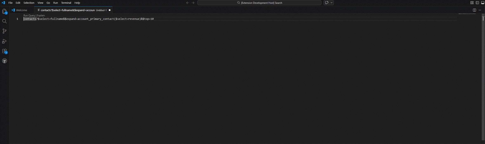

# DV Quick Run
A metadata-aware Dataverse query, investigation, and action workbench for VS Code — powered by a scalable disk-backed metadata engine and a stabilised, model-driven Result Viewer.

**Run, build, understand, and investigate Dataverse Web API data directly inside VS Code with metadata‑aware developer tooling.**

### A Dataverse developer console inside VS Code

DV Quick Run turns VS Code into a **Dataverse developer workbench**.  
Instead of jumping between Postman, browser tabs, maker portals, and documentation, you can **write, refine, execute, investigate, and act on Dataverse data without leaving the editor**.

---

## Keywords

Dataverse • Dynamics 365 • Power Platform • Web API • OData • VS Code extension • Developer tooling

---

## 🆕 What's New in v0.5.2

### 🧱 Result Viewer Architecture Refactor

This release introduces a **major internal refactor of the Result Viewer**, improving maintainability, consistency, and future extensibility.

- Introduced a **model-driven rendering pipeline**
  - Result semantics (value types, actions, export values) are now computed in the ViewModel layer
  - Webview is simplified to a rendering-only layer
- Reduced coupling between UI rendering and business logic
- Established a clean separation between:
  - data interpretation
  - rendering
  - interaction handling

---

### 🔒 Stability & Consistency Improvements

- Improved consistency across:
  - table rendering
  - action behaviour
  - export handling
- Eliminated several edge-case inconsistencies between raw values and display values
- Strengthened internal invariants to prevent future regressions

---

### 🧪 Test Coverage & Refactor Safety

- Expanded Result Viewer test coverage to lock down:
  - cell semantics (scalar / object / array)
  - action grouping (primary vs overflow)
  - export and drawer behaviour
- Ensures future changes do not unintentionally alter rendering behaviour

---

### 💡 Why This Matters

While this release introduces **no visible UI changes**, it is a critical foundation upgrade.

## 🆕 What's New in v0.5.1

### 🛠 Result Viewer Stabilization

This release focuses on **stability, correctness, and real-world usability** of the Result Viewer.

- Improved rendering reliability across nested and complex payloads  
- Better handling of objects and arrays within table cells  
- More consistent column ordering and display behaviour  
- Strengthened separation between display values and raw values (for actions)

---

### 🔍 Investigation Input Hardening

Investigation workflows are now more resilient to real-world inputs.

- Improved GUID extraction from:
  - noisy log text
  - partial JSON fragments
  - mixed selections  
- Case-insensitive GUID handling  
- More reliable candidate resolution when multiple identifiers are present  

---

### ⚙️ Behavioural Improvements

- Improved fallback handling when metadata inference is ambiguous  
- Better error messaging for failed investigations  
- Increased consistency across query → result → action flows  

---

### 🧪 Test Coverage Expansion

- Added and refined tests for:
  - investigation input resolution  
  - edge-case candidate selection  
  - result view model behaviour  

---

## 🆕 What's New in v0.5.0

### 🧠 Metadata Engine Stabilization (Major)

This release introduces a **fundamental upgrade to how metadata is stored and managed**, dramatically improving performance and stability for metadata-heavy workflows.

DV Quick Run now uses a **disk-backed metadata cache** instead of storing large payloads in VS Code extension state.

---

### 💾 Disk-Backed Metadata Storage

Metadata is now persisted to disk under VS Code’s extension storage instead of global state.

- File-per-entity storage model
- Environment-scoped metadata directories
- Granular reads and writes (no large blob rewrites)

This results in:

- faster metadata access
- more predictable performance
- easier cache inspection and debugging

---

### ⚡ Performance & Stability Improvements

This change eliminates a major source of extension host slowdowns.

- No more large metadata payload growth in VS Code state
- Significantly reduced risk of extension host freezes
- Improved responsiveness for:
  - Explain Query
  - metadata hover
  - relationship exploration
  - Smart GET workflows

---

### 🔬 Enhanced Metadata Diagnostics

Diagnostics now provide better visibility into metadata cache health.

You can now see:

- storage mode (disk-backed)
- per-cache bucket sizes
- total metadata footprint

This makes it easier to understand and troubleshoot metadata behaviour.

---

### 🔎 Explain Query – Relationship Advice (Phase 2A)

Explain Query now provides **Field Provenance & Relationship Advice**.

When a field does not belong to the base entity, DV Quick Run can now suggest:

- which related entity the field likely belongs to
- where the field is coming from in the query context

Example:
    contacts?$select=fullname,revenue

Explain Query will indicate:

> `revenue` appears to belong to related entity `account`, not `contact`

This works for:

- `$select`
- `$orderby`

Advice is derived safely from validation signals — no heavy runtime traversal.

---

### 🧱 Foundation for Future Intelligence

This release lays the groundwork for upcoming capabilities:

- structured metadata reasoning
- scope-aware hover (including `$expand` context)
- deeper Explain Query insights
- advanced investigation workflows

---

### 💡 Why This Matters

This is not just a feature release — it’s a **platform stabilization milestone**.

By moving metadata out of VS Code state and into a proper storage model, DV Quick Run is now better equipped to scale:

- larger environments
- richer metadata reasoning
- more advanced developer tooling

without compromising performance.

---

## 🚀 Result Viewer Demo

Typical workflow:

write query  
→ run query  
→ inspect results in table view  
→ drill into nested data (drawer)  
→ switch to JSON when needed  
→ refine and re-run   

Everything happens **inside VS Code**.

---

# ⚡ Quick Start

1. Install **DV Quick Run**
2. Login with Azure CLI
    az login --allow-no-subscriptions

3. The first time you run DV Quick Run you will be prompted to **configure a Dataverse environment**.

Provide:

- **Environment name** (example: DEV)
- **Dataverse URL** (example: https://org.crm6.dynamics.com)
- **Optional status color** (white / amber / red)

4. Write a Dataverse query in a file
contacts?$top=10

5. Click **Run Query** in CodeLens.

# 🌍 Environment Profiles

DV Quick Run supports working with **multiple Dataverse environments**.

Typical setups include:

- DEV
- SIT
- UAT
- PROD

The currently active environment is shown in the **VS Code status bar**.

Example:
DV: DEV

## Environment Commands

Available commands:

- **DV Quick Run: Add Environment**
- **DV Quick Run: Select Environment**
- **DV Quick Run: Remove Environment**

These commands manage the environments stored in:
dvQuickRun.environments

inside your VS Code settings.

## Environment Safety

To prevent cross-environment issues:

- Metadata caches are **scoped per environment**
- Session caches are **cleared automatically when switching environments**
- Diagnostics clearly show **which environment's cache is being inspected**
---

# ✨ Why DV Quick Run?

Working with the Dataverse Web API usually involves a fragmented workflow:

- Write a query
- Copy it into Postman
- Run it
- Inspect results
- Look up metadata
- Adjust the query
- Repeat

DV Quick Run collapses that loop into a **single, continuous developer workflow inside VS Code**.

---

# 🔎 CodeLens Query Execution

DV Quick Run automatically detects probable Dataverse queries and adds **inline CodeLens actions**.

[Run Query] [Explain]
accounts?$top=10

This turns your editor into a **lightweight Dataverse query workbench**.

---

# 🧠 Explain Query

Understanding a Dataverse query can sometimes be harder than writing it.

DV Quick Run breaks a query into **human-readable sections**.

Example query:
contacts?$select=fullname&$filter=contains(fullname,'john')&$orderby=createdon desc&$top=25

Explain Query shows:

- entity path
- record vs collection query
- selected fields
- filter meaning
- sort order
- query shape advice

Great for **learning and reviewing queries**.

---

# 🔍 Metadata Hover

Hover over fields inside a query to see **Dataverse metadata**.

Example:
contacts?$select=fullname,emailaddress1

Hovering a field may display:

- logical name
- display name
- attribute type
- choice values (if applicable)

Metadata is cached using a **disk-backed storage model** for fast, scalable, and stable repeated lookups across large environments.

---

# 🔧 Smart GET from GUID

Select a GUID in the editor and instantly generate a record query.

Example selected GUID:

    7d29eec7-4414-f111-8341-6045bdc42f8b

Generated query:

    contacts(7d29eec7-4414-f111-8341-6045bdc42f8b)

Or pick fields:

    contacts(7d29eec7-4414-f111-8341-6045bdc42f8b)?$select=fullname,emailaddress1

---

# 🧰 Query Mutation Helpers

Incrementally refine existing queries.

Available helpers:

- **Add Fields ($select)**
- **Add Filter ($filter)**
- **Add Expand ($expand)**
- **Add Order ($orderby)**

Example transformation:

Original:

    contacts

Add fields:

    contacts?$select=fullname,emailaddress1

Add filter:

    contacts?$select=fullname,emailaddress1&$filter=contains(fullname,'john')

---

# ⚙️ Smart GET Builder

Generate Dataverse queries through guided prompts.

Workflow:

Choose entity  
→ Choose fields  
→ Optional filters  
→ Optional sorting  
→ Build query  
→ Run query  

Example generated query:
accounts?$select=name,accountnumber

---

# ✏️ Smart PATCH Builder

Update Dataverse records using guided prompts.

Workflow:

choose entity  
→ choose record  
→ choose fields  
→ enter values  
→ execute PATCH  

No manual request construction required.

---

# 🔁 Generate Query from JSON

Convert a JSON record into a Dataverse query skeleton.

Example JSON:

    {
      "fullname": "John Smith"
    }

Generated query:

    contacts?$filter=fullname eq 'John Smith'

Useful when exploring Dataverse responses.

---

# 🔗 Relationship Explorer

Explore how Dataverse entities are connected.

Example:

    contact
    ├─ createdby → systemuser
    ├─ parentcustomerid_account → account
    └─ parentcustomerid_contact → contact

This helps developers understand **which `$expand` paths are available**.

The generated report opens as:

`Relationship Explorer - entity.txt`

making it easy to inspect relationships while investigating records.

### Relationship Graph View

Graph view shows the **relationship structure of an entity** in a readable hierarchy.

Example output:

`Relationship Graph - entity.txt`

This provides a quick structural overview of how an entity connects to other tables.

Graph view currently shows **direct (1-level) relationships**.

Future versions will support **recursive traversal**.

---

# 🛡 Guardrails for Risky Queries

DV Quick Run detects risky query shapes such as:

- missing `$top`
- overly broad queries
- expensive query patterns

Instead of silently executing them, the extension warns and asks for confirmation before sending the request.

---

# 🧠 Metadata Intelligence

DV Quick Run uses Dataverse metadata to power many of its features.

This enables:

- intelligent field pickers
- navigation property discovery
- query explanation
- schema-aware helpers
- relationship exploration

This metadata intelligence layer is now backed by a disk-based storage architecture, enabling:

- scalable metadata access across large environments
- stable performance during metadata-heavy operations
- future capabilities such as:
  - query validation
  - relationship reasoning
  - scope-aware query understanding
  - investigation and troubleshooting workflows

---

# 🔬 Metadata Diagnostics

DV Quick Run includes commands to inspect and manage metadata caches.

Available commands:

- Show Metadata Diagnostics
- Clear Metadata Session Cache
- Clear Persisted Metadata Cache

These tools help developers verify metadata loading behaviour and recover quickly after schema changes.

Diagnostics are **scoped to the currently active environment**, ensuring caches from different environments do not mix.

Diagnostics now also provide insight into metadata storage behaviour, including:

- storage mode (disk-backed)
- per-cache metadata size
- total metadata footprint

This helps identify performance issues and understand how metadata is being cached.

---

# 🔐 Authentication

DV Quick Run uses **Azure CLI authentication**.

If you are already logged in with Azure CLI, the extension will reuse that token.

Login example:

    az login --allow-no-subscriptions

No client secrets or OAuth configuration required.

Tokens are cached per Dataverse environment scope, allowing DV Quick Run to safely switch between environments without re-authenticating unnecessarily.

---

# 👥 Who Is This For?

DV Quick Run is designed for:

- Dataverse developers
- Dynamics 365 engineers
- Power Platform technical teams
- API developers integrating with Dataverse
- Integration engineers

---

# 🛠 Development

Run locally:
npm install
npm run compile

Press **F5** in VS Code to launch the **Extension Development Host**.

---

# 📜 License

MIT License

---

# 💡 Final Thought

DV Quick Run is built around one idea:

**The fastest Dataverse workflow is the one where you never leave the editor — and never break your flow.**