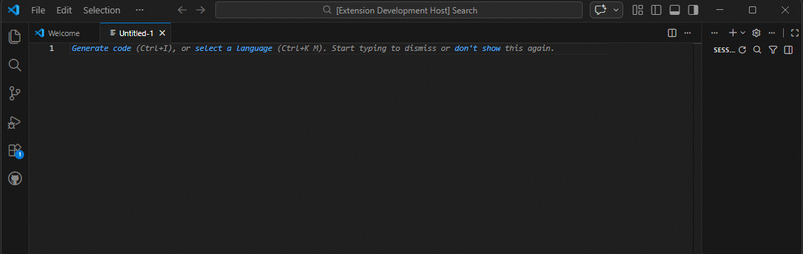

# DV Quick Run

**Run, build, and understand Dataverse Web API queries directly inside VS Code.**

DV Quick Run turns VS Code into a **Dataverse developer console**.  
Instead of jumping between Postman, browser tabs, maker portals, and documentation, you can **write, refine, execute, and explain queries without leaving the editor**.

---

## 🚀 Animated Demo



Example workflow:

write query  
→ refine query  
→ run query  
→ inspect results  
→ explain query  
→ improve query  

Everything happens **inside VS Code**.

---

# ✨ Why DV Quick Run?

Working with the Dataverse Web API usually involves a fragmented workflow:

- Write a query  
- Copy it into Postman  
- Run it  
- Inspect results  
- Look up metadata  
- Adjust the query  
- Repeat  

DV Quick Run collapses that loop into a **single editor experience**.

---

# ⚡ Key Features

## Run Dataverse Queries Instantly

Execute Web API queries directly from the editor.

Example:

```
accounts?$top=5
```

or

```
contacts?$select=fullname,emailaddress1&$top=10
```

Results appear instantly in a **virtual JSON document inside VS Code**.

---

## Run Query Under Cursor

Place your cursor on a query line and run it.

Example file:

```
accounts?$top=5
contacts?$top=10
opportunities?$top=5
```

Run only the query under your cursor.

No copy‑paste required.

---

## CodeLens Query Execution

DV Quick Run automatically detects probable Dataverse queries and adds **inline CodeLens actions**.

```
accounts?$top=10
[Run Query] [Explain]
```

This turns your editor into a **lightweight Dataverse workbench**.

---

## Explain Query

Understanding a Dataverse query can sometimes be harder than writing it.

DV Quick Run can break a query into **human‑readable sections**.

Example query:

```
contacts?$select=fullname&$filter=contains(fullname,'john')&$orderby=createdon desc&$top=25
```

Explain Query shows:

- entity path
- record vs collection query
- selected fields
- filter meaning
- sort order
- query shape advice

Great for **learning and reviewing queries**.

---

## Smart GET Builder

Generate Dataverse queries through guided prompts.

Workflow:

Choose entity  
→ Choose fields  
→ Optional filters  
→ Optional sorting  
→ Build query  
→ Run query  

Example generated query:

```
accounts?$select=name,accountnumber
```

---

## Smart GET from GUID

Select a GUID in the editor and instantly generate a record query.

Example selected GUID:

```
7d29eec7-4414-f111-8341-6045bdc42f8b
```

Generated query:

```
contacts(7d29eec7-4414-f111-8341-6045bdc42f8b)
```

Or pick fields:

```
contacts(7d29eec7-4414-f111-8341-6045bdc42f8b)?$select=fullname,emailaddress1
```

---

## Smart PATCH Builder

Update records using guided prompts.

Workflow:

choose entity  
→ choose record  
→ choose fields  
→ enter values  
→ execute PATCH  

No manual request construction required.

---

## Query Mutation Helpers

Incrementally refine existing queries.

Available helpers:

- **Add Fields ($select)**
- **Add Filter ($filter)**
- **Add Expand ($expand)**
- **Add Order ($orderby)**

Example transformation:

Original:

```
contacts
```

Add fields:

```
contacts?$select=fullname,emailaddress1
```

Add filter:

```
contacts?$select=fullname,emailaddress1&$filter=contains(fullname,'john')
```

---

## Generate Query from JSON

Convert a JSON record into a query skeleton.

Example JSON:

```
{
  "fullname": "John Smith"
}
```

Generated query:

```
contacts?$filter=fullname eq 'John Smith'
```

Useful when exploring Dataverse responses.

---

## Guardrails for Risky Queries

DV Quick Run detects risky query shapes such as:

- missing $top
- overly broad queries
- expensive query patterns

Instead of silently executing them, the extension **warns and asks for confirmation**.

---

# 🔐 Authentication

DV Quick Run uses **Azure CLI authentication**.

If you are already logged in with Azure CLI, the extension will reuse that token.

Login example:

```
az login --allow-no-subscriptions
```

No client secrets or OAuth configuration required.

---

# 🔄 Typical Workflow

Example development loop:

1. Write query

```
contacts?$top=10
```

2. Run query with CodeLens

3. Inspect JSON result

4. Add fields with helper

```
contacts?$select=fullname,emailaddress1&$top=10
```

5. Explain query

6. Refine filter

This loop is **much faster than traditional REST tooling**.

---

# 👥 Who Is This For?

DV Quick Run is designed for:

- Dataverse developers
- Dynamics 365 engineers
- Power Platform technical teams
- API developers integrating with Dataverse
- Integration engineers

---

# 🛠 Development

Run locally:

```
npm install
npm run compile
```

Press **F5** in VS Code to launch the **Extension Development Host**.

---

# 📜 License

MIT License

---

# 💡 Final Thought

DV Quick Run is built around one idea:

**The fastest Dataverse workflow is the one that never leaves the editor.**
