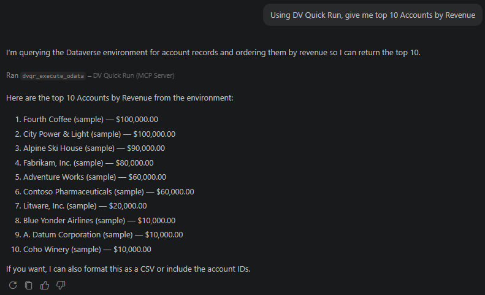
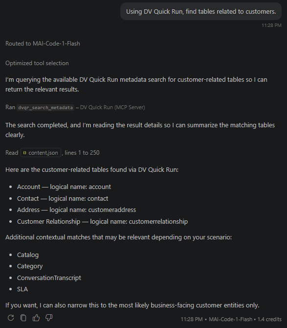
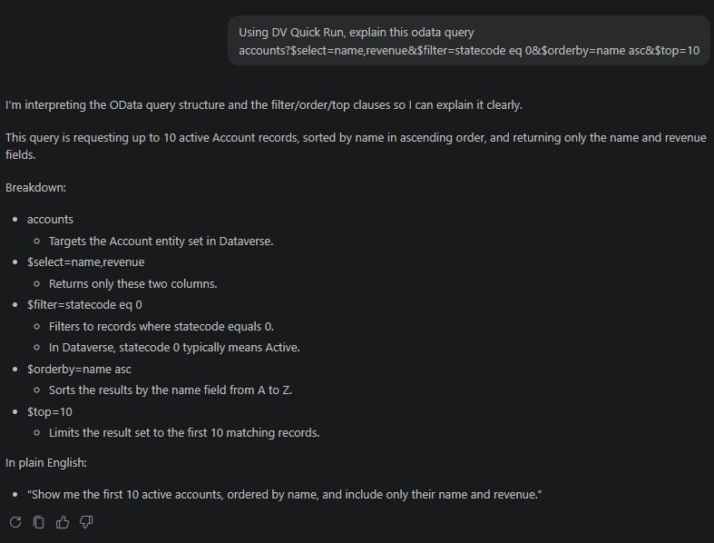
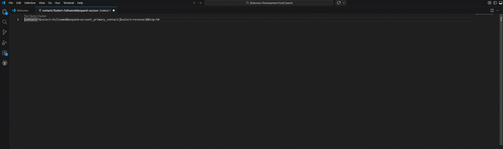
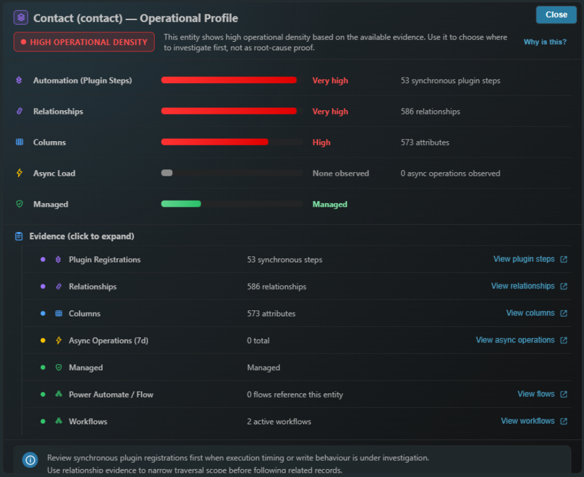
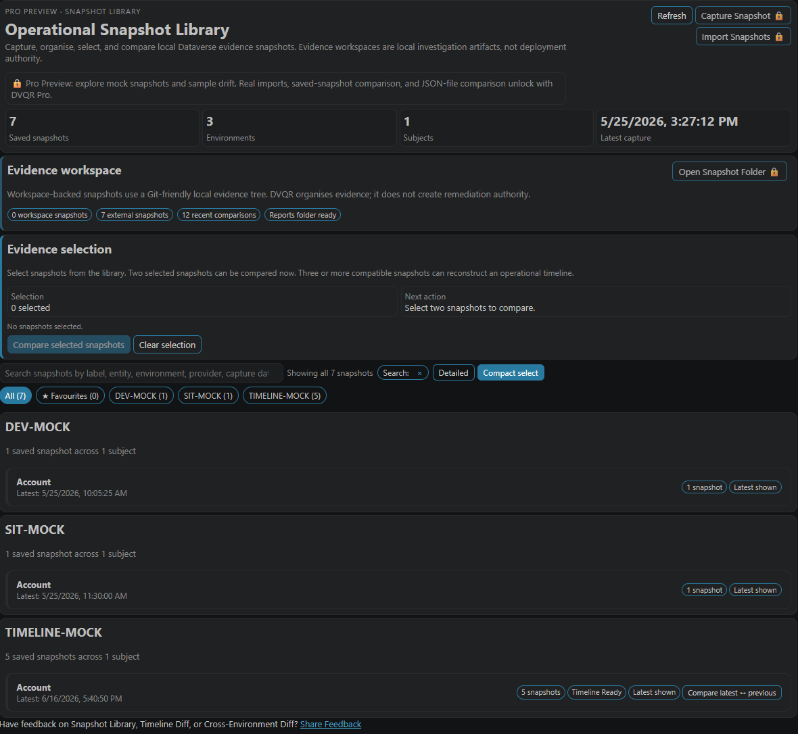

# DV Quick Run

**Understand Dataverse applications. Investigate operational behaviour. Stay grounded in evidence.**

DV Quick Run is an extension-owned **Local MCP server** and metadata-aware Dataverse investigation workbench for VS Code. Ask Dataverse questions in natural language, discover business architecture, run bounded queries, follow real relationships, preserve verified business paths, and continue into evidence-backed investigation without leaving the editor.

**Read-only MCP foundations · Deterministic metadata · Evidence-backed conclusions · Human authority**

[Website](https://www.dvquickrun.com) · [Pricing](https://www.dvquickrun.com/pricing) · [GitHub Discussions](https://github.com/yongjinsim-sudo/dv-quick-run/discussions)

---

## What's New in v0.16.1

### MCP Security Hardening I + Guided Traversal Business Path Capture

v0.16.1 hardens the model ↔ MCP ↔ DVQR boundary and completes the path from bounded traversal evidence into reusable Managed Business Paths.

```text
validate → execute bounded → verify exact route → save/reverify → reuse safely
```

- **Server-side MCP authority** — registered schemas, capability allow-lists, environment binding, bounds and entitlement remain application-owned rather than prompt-controlled.
- **Untrusted-input hardening** — malformed identifiers, unsafe environment URLs, fabricated control fields, path/file manipulation and credential-shaped output are rejected or redacted at the DVQR boundary.
- **Explicit Save / Verify** — a useful Guided Traversal route can be deliberately captured; identical canonical routes retain the same Business Path ID and refresh verification evidence instead of creating duplicates.
- **Evidence-aware reuse** — saved guidance is revalidated against current metadata before reuse; Saved, runtime-verified and Preferred remain distinct states.
- **Empty-frontier scope guard** — a saved-path run that reaches no continuation terminates its investigation scope server-side. Automatic OData, alternate-route, target-expansion or probe broadening cannot silently continue it.
- **Auditable new-scope transition** — broader follow-up investigation requires an explicit Business Path scope transition before DVQR will continue.
- **Accurate null-navigation evidence** — null/204 singleton navigation results are treated as zero landed records rather than apparent returned data.

Managed Business Paths remain workspace guidance, not Dataverse truth: current metadata, bounded runtime evidence, user preference and causality stay separate.

### Discoverability remains built in

The **94-prompt Prompt Library** (69 Free + 25 Pro) remains the guided entry point to DVQR's Local MCP capabilities, including Operational Profile + calibrated DVQR Score, relationship intelligence, bounded traversal and managed investigation.

---

## Start in Three Ways

| Start here | Best for | What you get |
|---|---|---|
| **Prompt Library** | You know the outcome but not the DVQR tool | Quick Starts, guided prompts, parameters and suggested next steps |
| **Local MCP** | You want to talk to Dataverse through Copilot | Metadata-aware discovery, architecture understanding, bounded querying and investigation |
| **Editor Workbench** | You already have a query, record or investigation | OData/FetchXML, Result Viewer, Guided Traversal, profiles, evidence and reports |

Open the two main orientation surfaces from the Command Palette:

```text
DV Quick Run: Open Prompt Library
DV Quick Run: Open Hub
```

---

## What DV Quick Run Can Do

### 1. Understand Dataverse

Translate structural metadata and bounded runtime evidence into an explainable view of an unfamiliar application.

- discover business capabilities and operational anchors
- identify Core Domain, Coordination, Execution, Governance and Platform layers
- explain why entities and routes were ranked
- distinguish metadata recommendation from runtime-observed workflow
- preserve confidence, provenance and uncertainty

### 2. Query & Explain

Work directly with Dataverse query surfaces in VS Code.

- natural-language OData through Local MCP
- OData and FetchXML execution
- `$batch` workflows
- Query-by-Canvas refinement
- Query Doctor and metadata-aware suggestions
- Query Explain
- preview-first Smart PATCH in the editor

### 3. Navigate Real Business Relationships

Move from metadata-valid relationships to data-viable traversal.

- relationship discovery and ranking
- Guided Traversal using returned rows
- Relationship Graph
- runtime path verification
- Managed Business Paths
- Preferred-path reuse with exact saved hops
- `$batch` traversal replay

### 4. Investigate Operational Behaviour

Use bounded evidence instead of speculative diagnosis.

- Result Viewer
- Execution Insights
- Operational Profiles
- DVQR Score
- Access Context for users, teams, roles, business units and application identities
- persisted Pro managed investigations
- evidence acquisition, readiness and Mini RCA

### 5. Compare & Reconstruct

Preserve evidence across environments and time.

- Evidence Workspace and Snapshot Library
- Cross-Environment Diff
- Timeline Reconstruction
- Timeline Graph
- Audit Evidence Enrichment
- findings, verification and handoff workflows
- HTML/PDF investigation reports

### 6. Discover & Govern Dataverse Capabilities

Inspect supported Custom APIs and Dataverse operations with explicit execution boundaries.

- Capability Explorer
- bound and unbound operation discovery
- metadata-backed request shaping
- preview-first supported execution
- explicit confirmation
- access-aware discovery
- execution diagnostics and investigation continuation

---

## See It in Action

### Ask Dataverse in natural language



### Find related tables deterministically



### Explain OData in plain English



### Explore query results



### Understand an entity's operational footprint



---

## Free and Pro

DV Quick Run follows an open-core model. Foundational Dataverse understanding remains accessible; Pro adds advanced investigation acceleration and persistence.

| Capability | Free | Pro |
|---|:---:|:---:|
| Prompt Library and Quick Starts | ✓ | ✓ |
| Deterministic metadata discovery | ✓ | ✓ |
| Natural-language OData and bounded GET | ✓ | ✓ |
| Relationship intelligence and Guided Traversal | ✓ | ✓ |
| Operational Profile + DVQR Score | ✓ | ✓ |
| Query workbench and Result Viewer | ✓ | ✓ |
| Managed Business Paths | ✓ | ✓ |
| Managed investigation lifecycle |  | ✓ |
| Cross-Environment Diff | Preview / samples where provided | ✓ |
| Timeline Reconstruction | Mock preview | ✓ |
| Audit Evidence Enrichment |  | ✓ |
| Mini RCA and investigation handoff |  | ✓ |
| Advanced report/export workflows |  | ✓ |
| Governed supported Custom API execution |  | ✓ |
| Online / Offline Pro licensing |  | ✓ |

A **14-day Pro Trial** is available for teams that want to evaluate the full investigation workflow.

---

## 5-Minute Quick Start

### A. Run DV Quick Run normally

1. Install **DV Quick Run** in VS Code.
2. Configure and select a Dataverse environment.
3. Run a query such as:

   ```http
   contacts?$top=10
   ```

4. Open **DV Quick Run: Open Hub** whenever you need orientation.

### B. Enable Local MCP

1. Select the Dataverse environment to expose to the local server.
2. Run:

   ```text
   DV Quick Run: Enable Local MCP Server
   ```

3. Sign into the environment tenant with Azure CLI. For a tenant without an Azure subscription:

   ```bash
   az login --tenant <tenant-id> --allow-no-subscriptions
   ```

4. Open GitHub Copilot Chat and make sure the DV Quick Run MCP tools are enabled.
5. Open **DV Quick Run: Open Prompt Library**, or ask directly:

   ```text
   Using DV Quick Run, show me what I can investigate in this Dataverse environment and recommend where to start.
   ```

DV Quick Run remembers MCP enablement per workspace. VS Code starts the extension-owned local stdio server on demand.

---

## Local MCP

DV Quick Run owns its local MCP lifecycle inside the extension. The Hub shows the selected environment, mode, tool count, authentication guidance and traffic-light health state.

The foundational MCP surface is deliberately bounded. It supports metadata understanding, relationship intelligence, natural-language querying and evidence acquisition without turning the assistant into an unrestricted Dataverse administrator.

Typical prompts:

```text
Using DV Quick Run, find tables related to customers.

Using DV Quick Run, explain this OData query:
accounts?$select=name,revenue&$filter=statecode eq 0&$orderby=name asc&$top=10

Using DV Quick Run, starting only from Contact metadata, discover the business capabilities and explain where operational work is coordinated and performed.

Using DV Quick Run, find and runtime-verify a relationship path from account to task.
```

### Business Architecture Understanding

Operational Workflow Intelligence separates structural evidence into:

- **Core Domain** — principal business, service, case, plan or request concepts
- **Coordination** — journey, process, routing and orchestration records
- **Execution** — tasks, activities and downstream work items
- **Governance** — eligibility, consent, approval, safety and control records
- **Platform** — plugins, flows, asynchronous jobs and integration participation

Strong structural evidence does not prove that a particular record participated. Runtime evidence remains investigation-scoped and does not overwrite metadata confidence.

---

## Managed Business Paths

Managed Business Paths turn verified traversal knowledge into a reusable workspace asset.

```text
metadata-valid path
        ↓
runtime verification
        ↓
explicit save
        ↓
Preferred workspace path
        ↓
record-scoped exact-hop Guided Traversal
```

A Preferred path is **top visible**, not exclusive. Metadata-derived alternatives remain available. Preference records useful team knowledge; it does not replace Dataverse metadata truth or prove universal business authority.

Saved paths live under:

```text
.dvforgelab/dvqr/business-paths
```

The runtime frontier is intentionally bounded:

```text
landed record IDs → exact next relationship → landed record IDs
```

If a hop returns no rows, traversal stops. DVQR does not convert an empty frontier into a table-wide query.

---

## Result Viewer & Guided Traversal

The Result Viewer is the main interactive surface for exploring query results.

```text
start simple → run → explore → refine → investigate → verify
```

Use it to:

- view records as table or JSON
- search and inspect results
- refine queries
- launch record investigation
- open relationship navigation
- continue Guided Traversal
- inspect operational context
- preview compatible bound Actions
- export evidence and supported handoff artifacts

Guided Traversal carries actual landed records from hop to hop. Managed Preferred paths can reuse the exact saved route from a supplied source record.

---

## Operational Profiles & DVQR Score

Operational Profiles describe the **operational footprint** of a Dataverse entity before deeper troubleshooting.

Profiles can surface:

- plugin orchestration density
- relationship complexity
- metadata footprint
- async participation
- Power Automate involvement
- workflow participation
- managed-state context


Profiles are entity-scoped, user-triggered, evidence-backed, bounded and advisory-only. The DVQR Score is a calibrated investigation aid, not a risk or root-cause score.

---

## Access Context

Access Context investigates bounded identity participation for:

- users and application identities
- teams
- roles
- business units

It can show business-unit context, direct and inherited participation, team membership and supporting evidence.

It does **not** simulate RBAC, calculate effective record access, generate privilege matrices or infer security risk.

---

## Managed Investigation

Pro managed investigations preserve professional investigation continuity rather than treating each prompt as an isolated answer.

```text
prepare & confirm
      ↓
acquire bounded evidence
      ↓
assess readiness
      ↓
generate bounded Mini RCA
      ↓
verify / hand off
```

The evidence model keeps supported, weakened and unresolved hypotheses distinct and preserves gaps rather than filling them with speculation.

---

## Evidence Workspace, Comparison & Timeline

DV Quick Run uses a local DV ForgeLab Evidence Workspace for investigation artifacts and reconstruction handoffs.

```text
.dvforgelab
└─ dvqr
   ├─ business-paths
   ├─ comparisons
   ├─ reports
   └─ snapshots
```

### Snapshot Library

Snapshot Library coordinates saved operational snapshots and comparison/timeline selection.



### Cross-Environment Diff

Compare compatible snapshots across environments and review grouped operational drift with evidence references, verification state and handoff context.

### Timeline Reconstruction

Select 3+ compatible snapshots from the same environment and entity to reconstruct snapshot-bounded intervals and first-observed drift.

DVQR can surface:

- Timeline Graph
- provider and significance distributions
- Timeline Trust
- Timeline Findings Summary
- Timeline Investigation Handoff
- optional Audit Evidence Enrichment

Timeline findings describe **when drift was first observed between captures**. They do not claim an exact change time, root cause, human responsibility or remediation status.

---

## Capability Explorer & Governed Execution

Capability Explorer discovers and explains supported Dataverse operations and Custom APIs.

It distinguishes:

- Functions vs Actions
- bound vs unbound operations
- public vs private visibility
- preview-ready vs inspect-only capability
- execution eligibility
- operational-impact cautions

Supported execution follows:

```text
preview → explicit confirmation → execution → inspect result → investigate evidence
```

Custom API metadata is discovery truth; OData metadata is execution-exposure truth; bound route metadata is execution-route truth; the active environment remains the execution authority boundary.

AI-related operation execution is blocked by default unless explicitly allowed by policy, and generated output still requires human review.

---

## DV ForgeLab Ecosystem

DV Quick Run investigates. Other DV ForgeLab utilities reconstruct or execute focused changes through explicit handoff artifacts.

Supported ecosystem handoffs include:

- **DVBUR** — focused bulk upsert artifacts
- **DVAF** — supported attribute reconstruction intent
- **DVIM** — identity management artifacts
- **DVCE** — choice artifacts
- **DVEVM** — environment variable artifacts

Investigation and reconstruction remain separate concerns.

---

## Guardrails

DV Quick Run favours explicit, preview-first, user-controlled workflows.

Key boundaries include:

- bounded queries and explicit execution context
- no silent Managed Business Path persistence
- no broadening after an empty traversal frontier
- no causal claims from participation alone
- no effective-access claims from Access Context participation
- no cross-environment timeline reconstruction
- no treatment of first-observed drift as exact historical time
- no treatment of audit rows as proof of causality
- no treatment of reports or exports as approval/certification
- no treatment of reconstruction artifacts as automatic remediation
- explicit confirmation for supported execution-capable workflows

DV Quick Run does not treat generated or AI-assisted responses as operational truth. Human verification remains the authority boundary.

---

## Pro Activation

DV Quick Run is available in Free and Pro editions.

Pricing: https://www.dvquickrun.com/pricing

Purchase: https://dvforgelab.lemonsqueezy.com

Activate Online Pro from the Command Palette:

```text
DV Quick Run: Activate Pro License
```

Inspect entitlement:

```text
DV Quick Run: License Status
```

Restricted or disconnected environments can use signed Offline Pro licensing:

```text
DV Quick Run: Import Offline License
```

---

## Who Is This For?

- Dataverse / Dynamics 365 developers
- Power Platform engineers
- integration and API developers
- support engineers investigating Dataverse behaviour
- consultants working across complex Dataverse environments
- teams onboarding into unfamiliar Dataverse solutions

---

## Why DV Quick Run?

Because useful Dataverse investigation is more than running a query:

```text
understand → query → verify → investigate → compare → explain → hand off
```

DV Quick Run reduces tool switching while keeping metadata truth, runtime evidence, user preference, execution authority and human judgement explicitly separated.

---

## Community & Feedback

GitHub Discussions: https://github.com/yongjinsim-sudo/dv-quick-run/discussions

Official website: https://www.dvquickrun.com

Use Discussions to report bugs, suggest features, share workflow feedback, discuss investigation patterns and submit evidence edge cases.

---

## Development

```bash
npm install
npm run compile
```

Press **F5** to run the extension.

For direct developer MCP verification after compiling:

```powershell
npm run mcp:start
```

For interactive inspection:

```powershell
npm run mcp:inspect
```

Azure CLI authentication must already be available through `az login`.

---

## License & Open-Core Model

DV Quick Run follows an open-core model.

The MIT-licensed core preserves foundational Dataverse understanding workflows. Proprietary Pro modules provide advanced investigation acceleration, persistence, comparison, timeline, reporting and governed execution capabilities.

```text
/src/core
MIT open-core functionality

/src/pro
Private proprietary acceleration modules
Not included in the public repository or MIT grant
```

Foundational operational understanding remains accessible. Commercial acceleration funds continued development.
